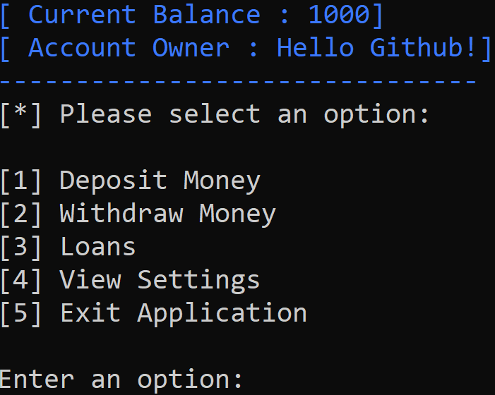

# Quantum Console Banking (IN DEVELOPMENT)

Quantum console banking application is a full banking system controlled and contained within a windows command console.

There is a BETA GUI version of Quantum Banking but it is still in early form and will be released as a separate package.

If you are more interested in the development side of things, please contact me on discord @ Nebula#0123



## Installation & Configuration

Use [VS2019](https://visualstudio.microsoft.com/downloads/) to open and edit the source code of this project. [ No release version yet ]

## What's planned for the future?

```
// Main Work
1. Stop Withdrawals taking negative number input
2. No negative balance
3. Finish Loans Menu
4. Add Settings Page
5. Overdraft/Loans Configuration

// Minor Issues
1. Optimize Threading/Code
2. Cleanse notes ( Internal notes )
3. Add Admin Console ( Add/Remove Bal, Loans ETC)
4. Add FAQ (Frequently Asked Questions)
```

## Contributing
Pull requests are welcome.

Please make sure to update tests as appropriate.
